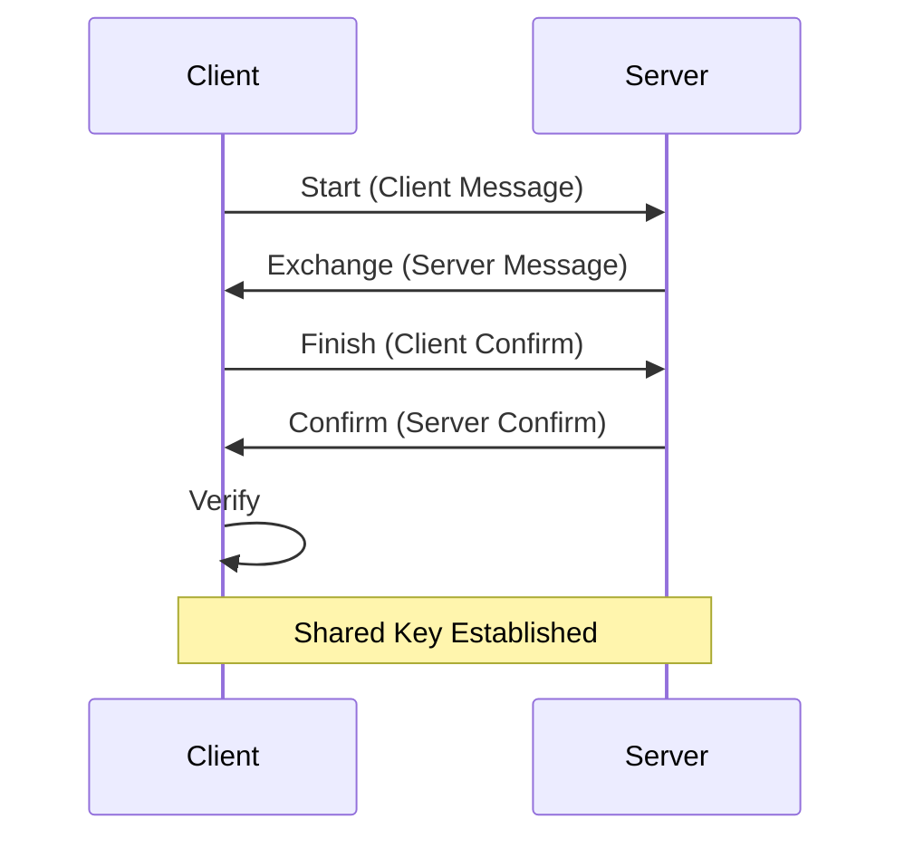

# SPAKE2

[](https://godoc.org/github.com/backkem/spake2-go)
[](https://github.com/backkem/spake2-go/actions/workflows/ci.yml)

A Go implementation of the SPAKE2 password-authenticated key exchange protocol.

## Overview

SPAKE2 is a secure, password-authenticated key exchange protocol that allows two parties to establish a shared secret key based on a low-entropy password without revealing the password to an eavesdropper. This implementation provides both client and server components for the SPAKE2 protocol.

⚠️ **Security Warning**: While this implementation has been tested against the official RFC 9382 test vectors for correctness, it has not undergone formal security review or audit for vulnerabilities. Use at your own risk in production environments. Consider having the code reviewed by security experts before deploying in security-critical applications.

## Features

- Implements the SPAKE2 protocol as described in [RFC 9382](https://www.rfc-editor.org/rfc/rfc9382).
- Tested against the test vectors provided in the RFC.

## Installation

To use this package in your Go project, you can install it using `go get`:

```bash
go get github.com/backkem/spake2-go
```

## Usage

Here's a basic example of how to use the SPAKE2 package:

```go
package main

import (
	"fmt"
	"github.com/backkem/spake2-go"
)

func main() {
	password := []byte("shared-password")

	// Create client and server instances
	client := spake2.NewClient(password, nil)
	server := spake2.NewServer(password, nil)

	// Client starts the protocol
	clientMsg, err := client.Start()
	if err != nil {
		panic(err)
	}

	// Server processes client's message
	serverMsg, err := server.Exchange(clientMsg)
	if err != nil {
		panic(err)
	}

	// Client processes server's message
	clientConfirm, err := client.Finish(serverMsg)
	if err != nil {
		panic(err)
	}

	// Server confirms client's message
	serverConfirm, err := server.Confirm(clientConfirm)
	if err != nil {
		panic(err)
	}

	// Client verifies server's confirmation
	err = client.Verify(serverConfirm)
	if err != nil {
		panic(err)
	}

	// Both parties can now access the shared key
	clientKey, _ := client.SharedKey()
	serverKey, _ := server.SharedKey()

	fmt.Printf("Client Shared Key: %x\n", clientKey)
	fmt.Printf("Server Shared Key: %x\n", serverKey)
}
```

## Protocol Flow

Below is a simplified flow of the SPAKE2 protocol exchange between client and server:



## Documentation

Full documentation is available on [GoDoc](https://godoc.org/github.com/backkem/spake2-go).

## License

This project is licensed under the MIT License - see the LICENSE file for details.

## Contributing

Contributions are welcome! Please feel free to submit a Pull Request.
